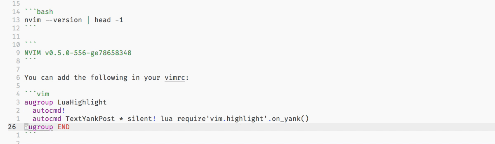

With the nightly version of neovim at the time of writing, when yanking text in neovim you can highlight the region before yanking it.



At the time of writing, you'll need a nightly release for this feature of neovim.

```bash
nvim --version | head -1
```

```
NVIM v0.5.0-556-ge78658348
```

You can also build neovim from source.
You can add the following in your vimrc to enable this feature:

```vim
augroup LuaHighlight
  autocmd!
  autocmd TextYankPost * silent! lua require'vim.highlight'.on_yank()
augroup END
```
