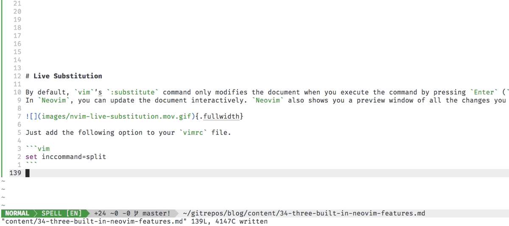

I want to share three built-in `neovim` features that are quality of life improvements for me.
They are **_live substitution_**, **_highlight yanked text_**, and the **_built in language server protocol client_**.

# Live Substitution

By default, `vim`’s `:substitute` command only modifies the document when you execute the command by pressing `Enter` (`<CR>`).
In `neovim`, you can update the document interactively. You can also have a preview of all the changes you are going to make.

{.fullwidth}

Just add the following option to your `vimrc` file.

```vim
set inccommand=nosplit
```

# Highlight Yanked Text

With the latest version of neovim, you have the ability to highlight yanked text without using any plugins[^1].

[^1]: _aside_: If you want to use this feature in `neovim` v0.4.x or in `vim` 8, you can do so with this plugin: <https://github.com/machakann/vim-highlightedyank>.

{.fullwidth}

At the time of writing, you'll need a `v0.5.0` or [`nightly`](https://github.com/neovim/neovim/releases/tag/nightly) release of `neovim` for this feature.

```bash
$ nvim --version | head -1
```

```
NVIM v0.5.0-556-ge78658348
```

You can add the following in your vimrc to enable this feature:

```vim
augroup LuaHighlight
  autocmd!
  autocmd TextYankPost * silent! lua require'vim.highlight'.on_yank()
augroup END
```

# Language Server Protocol

`neovim` has a built-in implementation of the [Language Server Protocol](https://microsoft.github.io/language-server-protocol/) client and [default configurations for over 50 languages](https://github.com/neovim/nvim-lsp).

{.fullwidth}

At the time of writing, you'll need a `v0.5.0` or [`nightly`](https://github.com/neovim/neovim/releases/tag/nightly) release of `neovim` for this feature.

```bash
$ nvim --version | head -1
```

```
NVIM v0.5.0-556-ge78658348
```

In order to set this up you need to do 3 things:

1) Add the `neovim/nvim-lsp` plugin:

    ```vim
    Plug 'neovim/nvim-lsp'
    ```

2) Run `:LspInstall {servername}`:

    ```vim
    :LspInstall sumneko_lua
    :LspInstall julials
    :LspInstall nimls
    :LspInstall rust_analyzer
    :LspInstall vimls
    :LspInstall pyls
    ```

3) Set up configurations with options in your `vimrc`:

    ```lua
    lua <<EOF
        local nvim_lsp = require'nvim_lsp'
        nvim_lsp.sumneko_lua.setup()
        nvim_lsp.julials.setup()
        nvim_lsp.nimls.setup()
        nvim_lsp.vimls.setup()
        nvim_lsp.pyls.setup{
            settings = {
                pyls = {
                    configurationSources = {
                        pycodestyle,
                        flake8
                    }
                }
            }
        }
    EOF
    ```
