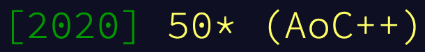

It is Christmas night, and it is the first time this month that I haven't planned had to plan schedule for the evening around a programming puzzle contest.
I participated in [Advent of Code 2020](https://adventofcode.com/2020/) this year, and I managed to collect all fifty stars!



I did all the puzzles in [Julia](https://julialang.org/) this year, and my solutions are available [here](https://github.com/kdheepak/adventofcode/tree/master/2020/julia/src).

# Why Advent of Code

Advent of Code is a lot of fun.
I think there's a few reasons I find it quite enjoyable.

Firstly, there's the competitive aspect of it.

A single puzzle unlocks every night at midnight Eastern Time, and your time when you submit a solution is recorded.
There's a global leaderboard that highlights the top 100 fastest times.
And you also have the ability to make a private leaderboard that you can share with anyone you like, and you can use that to track your time and challenge your friends / peers.
For straightforward puzzles, it is a lot of fun to see who can read, grok and type out a bug-free working program the fastest.
A bunch of people also upload recordings of their attempts, and it is humbling to see how fast they can whip out a correct solution to a problem.

Secondly, unlike most other competitive programming challenges, the puzzles are mainly designed to be a teaching / learning experience.

Every puzzle has two parts, where the first part introduces a prompt, and requires you to solve it before viewing the second part.
The first part tends to set up an idea or check that you are on the right track, and the second part tends to extend the idea or subvert an obvious decision you made in the first part.

There's a lot of "ah ha" moments when you figure something out.

Most problems are standard computer science programming problems, but are never presented as such.
Some problems have a mathematics tilt to it, which can make finding such solutions very satisfying.
But also, every problem is designed such that even if you don't know the "theory" behind it you'll be able to solve it.
And when you do, reading other people's one liners is quite enlightening.

Almost all the problems require parsing text input of various formats.
And since various programming language communities discuss their solutions in dedicated forums, there tends to be a lot of discussions about the tips and tricks in your favourite programming language that you could use to express the problem more elegantly.
Even after having used Python and Julia for years now, I still learn new things about these programming languages when I read other people's solutions.

And finally, the community.

The [/r/adventofcode](reddit.com/r/adventofcode) subreddit and the Julia Zulip and Slack channel have been a joy to visit every day after solving the puzzles.
I particularly enjoyed seeing all the neat visualizations that come out of Advent of Code by the community.

If you've never heard of Advent of Code, I highly recommend you try it out.
Below I'll be discussing solutions from solving this year's Advent of Code, which will contain spoilers.

# Solutions

## [Day 1](https://adventofcode.com/2020/day/1)

Day 1 of advent of code basically is intended to check that you have a programming language installed, and you know how to simple features it in (e.g. `for` loops).

However, a more idiomatic solution can be expressed using the `combinations` function from the [`Combinatorics.jl`](https://github.com/JuliaMath/Combinatorics.jl):

```julia
using Combinatorics

readInput() = parse.(Int, split(strip(read(joinpath("src/day01/input.txt"), String))))

expense_report(data, n) = only(prod(items) for items in combinations(sort(data), n) if sum(items) == 2020)

part1(data = readInput()) = expense_report(data, 2)
part2(data = readInput()) = expense_report(data, 3)
```

Python has a similar function in the standard library: <https://docs.python.org/3/library/itertools.html#itertools.combinations>

## [Day 2](https://adventofcode.com/2020/day/2)

Day 2 is a simple case of parsing, counting characters in a string and knowing that "exactly one" can be expressed using `xor`.

Julia supports infix operators for `xor`: `⊻`. The solution below is based on [Sukera's](https://github.com/Seelengrab/AdventOfCode).

```julia
readInput() = split(strip(read("src/day02/input.txt", String)), '\n')

function parseInput(data)
    d = split.(data, ": ")
    map(d) do (policy,password)
        rule, letter = split(policy, ' ')
        low, high = parse.(Int, split(rule, '-'))
        (low, high, only(letter), strip(password))
    end
end

function part1(data = readInput())
    count(parseInput(data)) do (low, high, letter, password)
        low <= count(==(letter), password) <= high
    end
end

function part2(data = readInput())
    count(parseInput(data)) do (low, high, letter, password)
        (password[low] == letter) ⊻ (password[high] == letter)
    end
end
```

In Julia, you can use the `only` function to get the one and only element in a collection.

## [Day 3](https://adventofcode.com/2020/day/3)

A lot of advent of code problems have the puzzle input as text that represents a grid.
Day 3 is our first introduction to a grid of trees.

Having a one liner to convert the text input to a `Matrix` can be very useful.
This solution is based on [Henrique Ferrolho's](https://github.com/ferrolho/advent-of-code/blob/b34dbe9ee5eef7a36fbf77044c83acc75fbe54cf/2020/03/puzzle.jl).

```julia
readInput() = permutedims(reduce(hcat, collect.(readlines("src/day03/input.txt"))))

function solve(trees, slope)
    n = cld(size(trees, 1), slope.y)
    rs = range(1, step=slope.y, length=n)
    cs = range(1, step=slope.x, length=n)
    cs = map(c -> mod1(c, size(trees, 2)), cs)
    idxs = CartesianIndex.(rs, cs)
    count(t -> t == '#', trees[idxs])
end

part1(data = readInput()) = solve(data, (x = 3, y = 1))
part2(data = readInput()) = prod(solve(data, s) for s in [
    (x = 1, y = 1),
    (x = 5, y = 1),
    (x = 3, y = 1),
    (x = 7, y = 1),
    (x = 1, y = 2),
  ])
```

Julia has `mod1` for 1 based mod, which is useful for indexing in these type of situations.
Julia also has ceiling division (`cld`) and floor division (`fld`) which happen to be handy here.

## [Day 4](https://adventofcode.com/2020/day/4)

Learning how to use regex in your programming language of choice that make solutions concise and terse.
For example, check out this terse solution by [Pablo Zubieta](https://github.com/pabloferz/AoC/blob/e64841e31d9dc9391be73b041a2e01795dafa1b6/2020/04/Day4.jl):

```julia
readInput() = split(read("src/day04/input.txt", String), "\n\n")

const fields1 = (r"byr", r"iyr", r"eyr", r"hgt", r"hcl", r"ecl", r"pid")
const fields2 = (
    r"byr:(19[2-9][0-9]|200[0-2])\b",
    r"iyr:20(1[0-9]|20)\b",
    r"eyr:20(2[0-9]|30)\b",
    r"hgt:(1([5-8][0-9]|9[0-3])cm|(59|6[0-9]|7[0-6])in)\b",
    r"hcl:#[0-9a-f]{6}\b",
    r"ecl:(amb|blu|brn|gry|grn|hzl|oth)\b",
    r"pid:\d{9}\b"
)

part1(data = readInput()) = count(p -> all(t -> contains(p, t), fields1), data)
part2(data = readInput()) = count(p -> all(t -> contains(p, t), fields2), data)
```

There were a lot of puzzles this year where I would have been able to more easily parse the input by knowing just a little bit more regex.

## [Day 5](https://adventofcode.com/2020/day/5)

Sometimes having a little insight into what the problem is asking can go a long way.
For example, in this puzzle, the seat ID is just a binary representation of the input.
So you can calculate the seat ID using binary shifting or by parsing the input as a binary number directly.
This solution is based on [Andrey Oskin's](https://github.com/Arkoniak/advent_of_code/blob/c692bc20147362cfb373e1483cf73588489a597b/2020/05/day05.jl):

```julia
seatid(s) = reduce((x, y) -> (x << 1) | ((y == 'R') | (y == 'B')), s; init = 0)
# OR
seatid(s) = parse(Int, map(c -> c ∈ ('R', 'B') ? '1' : '0', s), base = 2)

part1() = mapreduce(seatid, max, eachline("src/day05/input.txt"))

function part2()
  seats = sort(seatid.(eachline("src/day05/input.txt")))
  prev = seats[1]
  for seat in seats
    (seat - prev == 2) && return prev + 1
    prev = seat
  end
end
```

## [Day 6](https://adventofcode.com/2020/day/6)

Day 6 introduces set operations with the prompt asking you to identify "any" and "every" question, which can be represented using union and intersection.

In Julia, you can use the unicode symbols of mathematical operations for union and intersection of sets.
Also, julia has methods on functions like `sum` that accept a function as the first argument, which is useful for mapping over every element in a collection.

```julia
readInput() = split.(split(read("src/day06/input.txt", String), "\n\n"))

part1(data = readInput()) = sum(q -> length(∪(Set.(q)...)), data)
part2(data = readInput()) = sum(q -> length(∩(Set.(q)...)), data)
```

Julia has support for broadcasting using the `f.(c)` syntax,
which allows for element by element application of the method `f` on every element in the collection `c`, i.e. `f(e) for e in c`.

## [Day 7](https://adventofcode.com/2020/day/7)

Day 7 is the first introduction to graphs this year.
While it is possible to find solutions to both parts of this puzzle using recursion,
the problem can be well represented as a graph.
This code is based on Ali Hamed Moosavian's and [Andrey Oskin's](https://github.com/Arkoniak/advent_of_code/blob/c692bc20147362cfb373e1483cf73588489a597b/2020/07/day07.jl) solutions:

```julia
using LightGraphs
using SimpleWeightedGraphs

readInput() = build_graph(split(strip(read("src/day07/input.txt", String)), '\n'))

function build_graph(data)
    edges = []
    for line in data
        outer_bag, inner_bags = split(line, " contain ")
        occursin("no other bags", inner_bags) && continue
        for bag in split(inner_bags, ", ")
            counter, name = parse(Int, first(bag)), strip(bag[3:end], '.')
            e = String(rstrip(outer_bag, 's')), String(rstrip(name, 's')), counter
            push!(edges, e)
        end
    end

    nodes = collect(Set(src for (src, _, _) in edges) ∪ Set(dst for (_, dst, _) in edges))
    mapping = Dict(n => i for (i,n) in enumerate(nodes))

    g = SimpleWeightedDiGraph(length(nodes))
    for (src, dst, counter) in edges
        add_edge!(g, mapping[src], mapping[dst], counter)
    end
    g, mapping, nodes
end

part1(data = readInput()) = part1(data[1], data[2])
part1(g, mapping) = count(!=(0), bfs_parents(g, mapping["shiny gold bag"], dir = :in)) - 1

function total_bags(g, v)
    isempty(neighbors(g, v)) && return 1
    1 + sum(neighbors(g, v)) do nb
        Int(g.weights[nb, v]) * total_bags(g, nb)
    end
end

part2(data = readInput()) = part2(data[1], data[2])
part2(g, mapping) = total_bags(g, mapping["shiny gold bag"]) - 1
```

## [Day 8](https://adventofcode.com/2020/day/8)

Day 8 was a straightforward op code interpreter.

```julia
readInput() = strip(read("src/day08/input.txt", String))

part1(data = readInput()) = boot(split(data, '\n'))

part2(data = readInput()) = corrupt(split(data, '\n'))

function boot(instructions)
    acc = 0
    i = 1
    s = Set()
    while true
        i ∈ s ? break : push!(s, i)
        inst, n = split(instructions[i])
        n = parse(Int, n)
        if inst == "acc"
            i += 1
            acc += n
        elseif inst == "jmp"
            i += n
        elseif inst == "nop"
            i += 1
        end
    end
    acc
end

function corrupt(original_instructions)
    for j in 1:length(original_instructions)
        boot_loop_detected = false
        acc = 0
        i = 1
        s = Set()
        instructions = copy(original_instructions)
        if occursin("jmp", instructions[j])
            instructions[j] = replace(instructions[j], "jmp" => "nop")
        elseif occursin("nop", instructions[j])
            instructions[j] = replace(instructions[j], "nop" => "jmp")
        end
        while true
            if i ∈ s
                boot_loop_detected = true
                break
            else
                push!(s, i)
            end
            i > length(instructions) && break
            inst, n = split(instructions[i])
            n = parse(Int, n)
            if inst == "acc"
                i += 1
                acc += n
            elseif inst == "jmp"
                i += n
            elseif inst == "nop"
                i += 1
            end
        end
        if !boot_loop_detected
            return acc
        end
    end
end
```

## [Day 9](https://adventofcode.com/2020/day/9)

Day 9 was also straightforward.

In Julia, you can combine multiple `for` loops iteration expressions into a single line.
You can even use the variable from the outer loop as the index in the inner loop, like you'd expect.
This can reduce the nesting level of your inner expressions.

```julia
readInput() = parse.(Int, split(strip(read("src/day09/input.txt", String)), '\n'))

function check(numbers, n)
    for i in numbers, j in numbers
        i + j == n && return true
    end
    false
end

function part1(numbers)
    preamble = 25
    for i in (preamble + 1):length(numbers)
        check(numbers[i-preamble:i-1], numbers[i]) && continue
        return i, numbers[i]
    end
end

function part2(numbers)
    idx, num = part1(numbers)
    for i in eachindex(numbers), j in i:lastindex(numbers)
        sum(numbers[i:j]) == num && return sum(extrema(numbers[i:j]))
    end
end
```

Teo ShaoWei's solution using [`Combinatorics.jl`](https://github.com/JuliaMath/Combinatorics.jl) is also quite elegant.

```julia
using Combinatorics

function bad_number(nums, k)
    for i in (k + 1):length(nums)
        if !any(num1 + num2 == nums[i] for (num1, num2) in combinations(nums[(i - k):(i - 1)], 2))
            return (i, nums[i])
        end
    end
end

function rectify(nums, k)
    v = bad_number(nums, k)
    i = 1
    j = 1
    while (s = sum(nums[i:j])) != v
        s < v ? j += 1 : i += 1
    end

    return minimum(nums[i:j]) + maximum(nums[i:j])
end

input = parse_input("input_puzzle.txt")
part1 = bad_number(input, 25)
part2 = rectify(input, 25)
```
