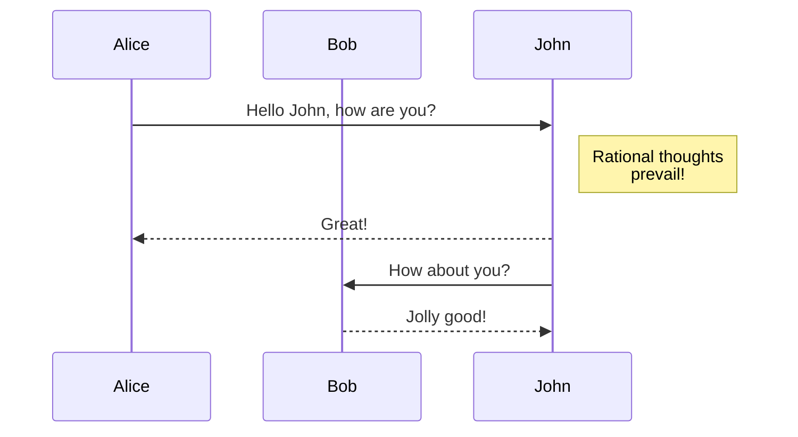

GitHub recently announced [support for MermaidJS](https://github.blog/2022-02-14-include-diagrams-markdown-files-mermaid).
I thought it would be nice to integrate it as part of my blog using Pandoc lua filters.
So the following:

````

````

would be rendered as:


