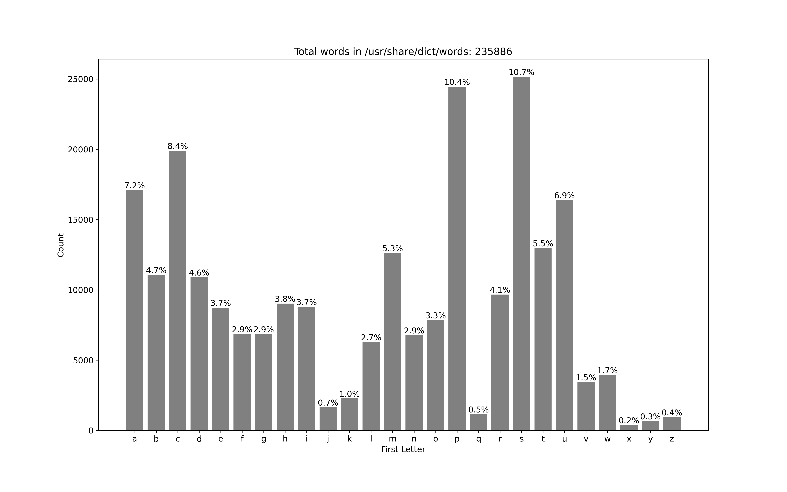
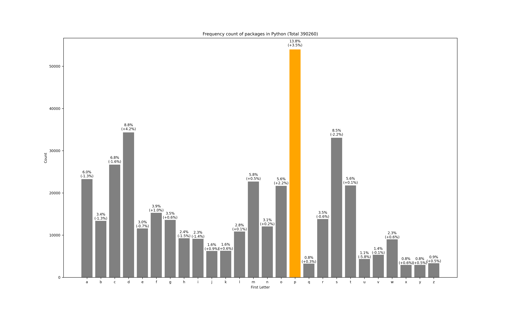
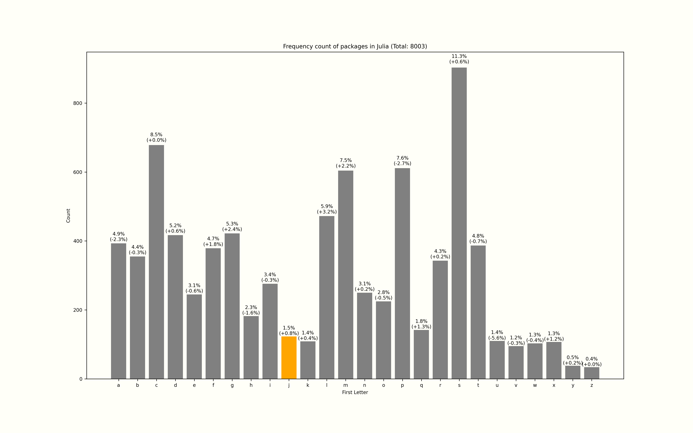
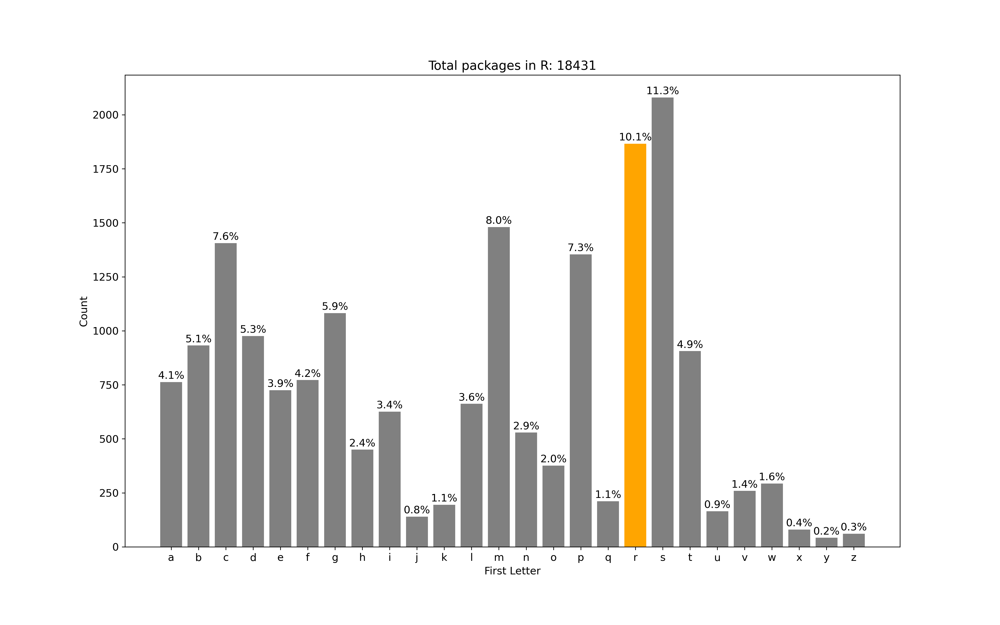
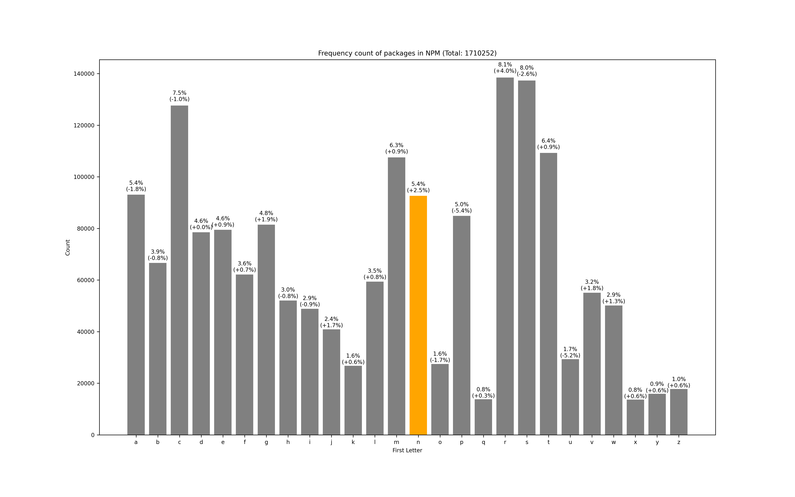

Are there trends in choosing package names in various programming ecosystems?
Do package authors choose names for their packages that are [alliterated](https://en.wikipedia.org/wiki/Alliteration) with the name of the programming language?
Let's venture to find out.

First let's install a couple of useful packages.

```bash
python -m pip install requests beautifulsoup4 pandas matplotlib
```

We can "bucket" the package names by their starting letter and count the number of packages in each bucket, i.e. a frequency plot.
The following is the code I'm using:

```{.python .collapse}
%matplotlib inline
import matplotlib.pyplot as plt
import numpy as np

plt.rc("font", size = 8)

from collections import defaultdict

reference = {}
total_reference = 0

def frequency_plot(items, lang, kind="packages"):
    bucket = defaultdict(lambda: 0)
    colors = defaultdict(lambda: "grey")
    for i in items:
        i = i.strip()
        bucket[i[0].lower()] += 1
    if kind=="packages":
        colors[lang[0].lower()] = "orange"
    keys = [k for k in sorted(list(bucket.keys())) if k.isalpha()]
    fig, axs = plt.subplots(1,1,figsize=(16,10),facecolor='#fffff8')
    ax = axs
    ax.bar(keys, [bucket[k] for k in keys], color=[colors[k] for k in keys], )
    total = sum(bucket[k] for k in keys)
    rects = ax.patches

    global reference
    global total_reference
    if kind != "packages":
        reference = bucket
        total_reference = total

    for rect, k in zip(rects, keys):
        height = rect.get_height()
        if kind == "packages":
            v = round(bucket[k] / total * 100 - reference[k] / total_reference * 100, 1)
            s = ["+", "-"][int(v < 0)]
        else:
            v = round(bucket[k] / total * 100, 1)
            s = ""
        if kind == "packages":
            label = f"{round(bucket[k] / total * 100, 1)}%\n({s}{abs(v)}%)"
        else:
            label = f"{s}{abs(v)}%"
        ax.text(
            rect.get_x() + rect.get_width() / 2, height*1.01, label, ha="center", va="bottom"
        )

    ax.set_title(f"Frequency count of {kind} in {lang} (Total: {total})")
    ax.set_ylabel("Count")
    ax.set_xlabel("First Letter")
    ax.set_facecolor("#fffff8")
    return ax
```

## English

For a reference case, let's plot the distribution of words in the English language, per the list in `/usr/share/dict/words` on my MacOS 12.5.

```{.python .collapse}
with open("/usr/share/dict/words") as f:
    words = set(f.read().split())

frequency_plot(words, "/usr/share/dict/words", kind="words")
```

```{.python .hide}
plt.savefig("./images/word-names.png", dpi=300, transparent=True);
```

{ .fullwidth }

## Python

For Python, we can get the list of packages on PyPi using <https://pypi.org/simple> and use a HTML parser to get all the links on that page.

```{.python .collapse}
import requests
from bs4 import BeautifulSoup

r = requests.get("https://pypi.org/simple")
soup = BeautifulSoup(r.text, 'html.parser')
packages = set()
for link in soup.find_all("a", href=True):
    packages.add(link.contents[0])

frequency_plot(packages, "Python")
```

```{.python .hide}
plt.savefig("./images/python-package-names.png", dpi=300, transparent=True);
```

{ .fullwidth }

The difference in percent of names of Python packages starting with "p" and words in the English language starting with "p" is +3.5%.
The largest positive difference however is with the letter "d", with "+4.2%".
I'm personally a little surprised it isn't higher.

## Julia

When you install a package using Julia, it downloads a general registry into your "home" directory, and we can traverse that directory only one level deep.

```{.python .collapse}
import os
packages = set()
for root, folders, files in os.walk(os.path.expanduser("~/.julia/registries/General/")):
    for folder in folders:
        if len(folder) > 1 and len("~/.julia/registries/General".split("/")) + 2 < len(root.split("/")):
            packages.add(folder)

frequency_plot(packages, "Julia")
```

```{.python .hide}
plt.savefig("./images/julia-package-names.png", dpi=300, transparent=True);
```

{ .fullwidth }

The difference in percent of names of Julia packages starting with "j" and words in the English language starting with "j" is +0.8%.

## Rust

<https://crates.io> conveniently has a [data-access](https://crates.io/data-access) page that links to the latest dump which contains a `csv` file with the names of all the packages.

```{.python .collapse}
import pandas as pd
packages = set(pd.read_csv("~/Downloads/2022-07-29-020018/data/crates.csv")["name"].dropna())

frequency_plot(packages, "Rust")
```

```{.python .hide}
plt.savefig("./images/rust-package-names.png", dpi=300, transparent=True);
```

{ .fullwidth }

In Rust, the difference is +3.9%, and it is the highest positive difference amongst all the letters.

## R

For R, similar to Python, we can parse the HTML from <https://cran.r-project.org/web/packages/available_packages_by_name.html>:

```{.python .collapse}
import requests
from bs4 import BeautifulSoup

r = requests.get("https://cran.r-project.org/web/packages/available_packages_by_name.html")
soup = BeautifulSoup(r.text, 'html.parser')
packages = set()
for link in soup.find_all("a", href=True):
    packages.add(link.contents[0])

frequency_plot(packages, "R")
```

```{.python .hide}
plt.savefig("./images/r-package-names.png", transparent=True, dpi=300)
```

{ .fullwidth }

In R, the difference is +6% for the letter "r". This is the biggest difference we've seen so far.

## NPM

For NPM packages, <https://replicate.npmjs.com/_all_docs> contains a 228 MB `json` that contains all the packages.

```{.python .collapse}
import json
import os
with open(os.path.expanduser("~/Downloads/_all_docs")) as f:
    data = json.loads(f.read())

packages = set()
for elem in data["rows"]:
    assert(elem["id"] == elem["key"])
    packages.add(elem["id"].split("/")[-1])

frequency_plot(packages, "NPM")
```

```{.python .hide}
plt.savefig("./images/npm-package-names.png", dpi=300, transparent=True);
```

{ .fullwidth }

## Conclusion

In all these cases, there is a greater percentage of packages whose name starts with the same letter as the name of the programming language compared to the average distribution of words in the English language.

However, I don't think it is enough to conclusively say that programmers prefer alliterating the package names with the programming language.
It would be nice to test this assumption on C, C++, and Go (and possibly other languages), but these languages, as far as I can tell, don't have central registries.
